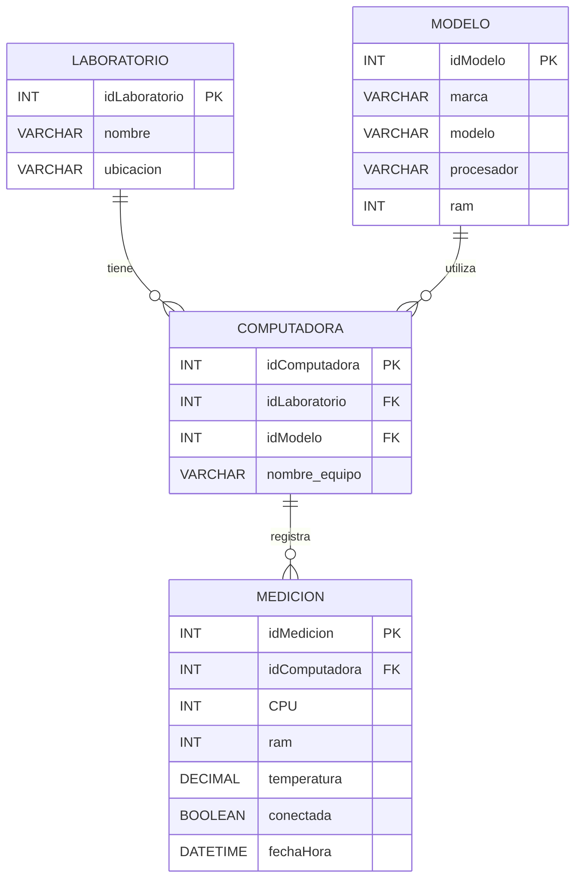

```mermaid
erDiagram

    LABORATORIO {
        INT idLaboratorio PK
        VARCHAR nombre
        VARCHAR ubicacion
    }

    MODELO {
        INT idModelo PK
        VARCHAR marca
        VARCHAR modelo
        VARCHAR procesador
        INT ram
    }

    COMPUTADORA {
        INT idComputadora PK
        INT idLaboratorio FK
        INT idModelo FK
        VARCHAR nombre_equipo
    }

    MEDICION {
        INT idMedicion PK
        INT idComputadora FK
        INT CPU
        INT ram
        DECIMAL temperatura
        BOOLEAN conectada
        DATETIME fechaHora
    }

    LABORATORIO ||--o{ COMPUTADORA : tiene
    MODELO ||--o{ COMPUTADORA : utiliza
    COMPUTADORA ||--o{ MEDICION : registra
```