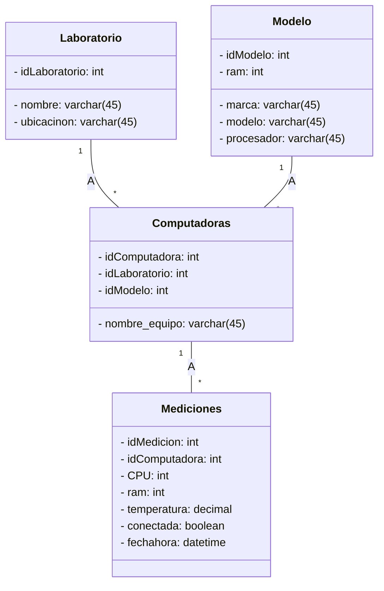

```mermaid
classDiagram
class Laboratorio{
    - idLaboratorio: int
    - nombre: varchar(45)
    - ubicacinon: varchar(45)  
}

class Modelo{
    - idModelo: int
    - marca: varchar(45)
    - modelo: varchar(45)
    - procesador: varchar(45)
    - ram: int
}

class Computadoras{
    - idComputadora: int
    - idLaboratorio: int 
    - idModelo: int
    - nombre_equipo: varchar(45)
}

class Mediciones{
    - idMedicion: int
    - idComputadora: int
    - CPU: int
    - ram: int 
    - temperatura: decimal
    - conectada: boolean
    - fechahora: datetime
}

Laboratorio "1"--"*" Computadoras: A
Modelo "1"--"*" Computadoras: A
Computadoras"1"--"*"Mediciones: A
```